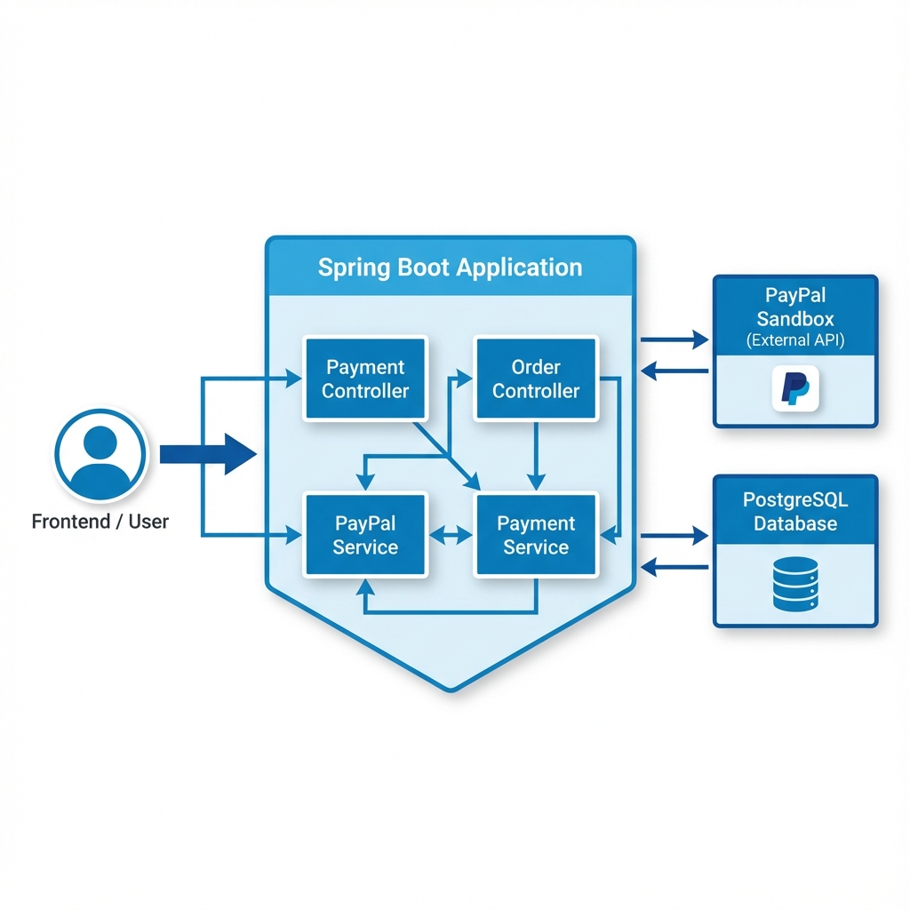

# 💳 PayPal Payment Gateway Demo

A comprehensive Spring Boot application demonstrating PayPal payment integration with all essential payment concepts for interview preparation and hands-on learning.


## 📚 Payment Concepts Covered

| Concept | Description | File Reference |
|---------|-------------|----------------|
| **One-Time Payments** | Standard checkout flow with immediate capture | `PaymentService.java` |
| **Authorization & Capture** | Hold funds for later capture (hotels, rentals) | `PayPalService.java` |
| **Refunds** | Full and partial refund processing | `RefundRequest.java` |
| **Webhooks** | Real-time payment event notifications | `WebhookService.java` |
| **Idempotency** | Prevent duplicate payments | `Payment.java` |
| **Payment States** | Track payment lifecycle | `PaymentStatus.java` |

---

## 🏗️ Architecture



---

## 🚀 Quick Start

### Prerequisites
- Java 17 or higher
- Maven 3.6+
- Docker (for PostgreSQL)
- PayPal Developer Account (Sandbox)

### 1. Clone & Configure

```bash
cd /Users/shivamsrivastav/Downloads/paypal-payment-demo
```

### 1. Start Database
```bash
docker-compose up -d
```

### 2. Configure Credentials
Update `src/main/resources/application.yml`. 
*   **Option A (Mock Mode):** Leave as default (ID starts with `YOUR_`).
*   **Option B (Real Mode):** Enter your actual Sandbox Client ID/Secret.

```yaml
paypal:
  client:
    id: YOUR_CLIENT_ID
    secret: YOUR_CLIENT_SECRET
```

### 3. Run Application
```bash
mvn spring-boot:run
```

### 4. Open Demo Page

Open your browser: **http://localhost:8080**

---

## 🎭 Mock Mode vs Real Mode

This project supports **Mock Mode** for easy testing without keys.

| Mode | Trigger | Behavior |
|------|---------|----------|
| **Mock Mode** | `paypal.client.id` starts with `YOUR_` | Returns fake success responses immediately. Perfect for local dev. |
| **Real Mode** | Valid `paypal.client.id` set | Calls actual PayPal Sandbox API. Requires valid credentials. |

To switch to **Real Mode**, simply update `application.yml` with your actual PayPal Client ID and Secret.

---

## 🔐 PayPal Sandbox Setup


1. Go to [PayPal Developer Dashboard](https://developer.paypal.com/dashboard/)
2. Login or create an account
3. Navigate to **Apps & Credentials**
4. Click **Create App** (Sandbox mode)
5. Copy **Client ID** and **Secret**
6. Add to `application.yml` or environment variables

---

## 📡 API Endpoints

### Payment Operations

| Method | Endpoint | Description |
|--------|----------|-------------|
| `POST` | `/api/payments/create` | Create new payment |
| `POST` | `/api/payments/execute` | Execute after approval |
| `POST` | `/api/payments/capture` | Capture authorized payment |
| `POST` | `/api/payments/refund` | Refund captured payment |
| `GET` | `/api/payments/{id}` | Get payment details |

### Webhooks

| Method | Endpoint | Description |
|--------|----------|-------------|
| `POST` | `/api/webhooks/paypal` | Receive PayPal webhooks |

---

## 🔄 Payment Flow

### Standard (CAPTURE) Flow

```
1. Customer clicks "Pay with PayPal"
           ↓
2. App creates payment → PayPal returns approval URL
           ↓
3. Customer redirects to PayPal → Logs in → Approves
           ↓
4. PayPal redirects to success URL with paymentId + PayerID
           ↓
5. App executes payment → Funds captured immediately
           ↓
6. Customer sees success page
```

### Authorization Flow

```
1. Create payment with intent=AUTHORIZE
           ↓
2. Customer approves → Funds are HELD (not charged)
           ↓
3. Later: Call capture endpoint to charge
           ↓
4. Or: Call void to release held funds
```

---

## 📁 Project Structure

```
src/main/java/com/shivamsrivastav/payment/
├── PaypalPaymentDemoApplication.java    # Main class
├── config/
│   ├── PayPalConfig.java                # PayPal SDK setup
│   └── WebConfig.java                   # CORS configuration
├── entity/
│   ├── Order.java                       # Customer orders
│   ├── Payment.java                     # Payment transactions
│   ├── Subscription.java                # Recurring payments
│   ├── WebhookEvent.java                # Webhook audit log
│   └── enums/                           # Status enums
├── repository/                          # JPA repositories
├── service/
│   ├── PayPalService.java               # Core PayPal integration
│   ├── PaymentService.java              # Business logic
│   ├── WebhookService.java              # Webhook handling
│   └── OrderService.java                # Order management
├── controller/
│   ├── PaymentController.java           # Payment REST API
│   ├── WebhookController.java           # Webhook receiver
│   └── PageController.java              # Redirect handlers
├── dto/                                 # Request/Response DTOs
└── exception/                           # Exception handling
```

---

## 💡 Key Concepts Explained

### 1. Idempotency
**Problem:** Network errors can cause duplicate payment attempts  
**Solution:** Use unique `idempotencyKey` for each payment

```java
// Same idempotency key = same payment returned (no duplicate charge)
payment.setIdempotencyKey(UUID.randomUUID().toString());
```

### 2. Authorization vs Capture
**Authorization:** Hold funds without charging (expires in 29 days)  
**Capture:** Actually charge the held funds

```java
// Hotels: Authorize at booking, capture at checkout
payment.setPaymentIntent(PaymentIntent.AUTHORIZE);
// Later...
payPalService.captureAuthorization(authId, amount);
```

### 3. Webhooks
**Purpose:** Reliable payment notifications even if user closes browser

```java
// Common events:
// - PAYMENT.CAPTURE.COMPLETED
// - PAYMENT.CAPTURE.REFUNDED
// - BILLING.SUBSCRIPTION.CANCELLED
```

---

## Testing

### API Contracts and Postman
For a detailed guide on API flows and JSON contracts, see [API_CONTRACT.md](API_CONTRACT.md).
You can also import the [Postman Collection](paypal-payment-demo.postman_collection.json) to easily test all endpoints.

### Using cURL
Here are some quick cURL commands to test the API:

### 1. Create Internal Order (Optional but Recommended)
```bash
curl -X POST http://localhost:8081/api/orders/create \
-H "Content-Type: application/json" \
-d '{
  "description": "Test Order",
  "amount": 100.00,
  "customerEmail": "test@example.com",
  "customerName": "Test User"
}'
```

### 2. Create Payment
```bash
curl -X POST http://localhost:8081/api/payments/create \
-H "Content-Type: application/json" \
-d '{
  "amount": 100.00,
  "currency": "USD",
  "description": "Payment for Order",
  "paymentIntent": "CAPTURE",
  "orderId": 1
}'
```

### Execute Payment
```bash
curl -X POST http://localhost:8080/api/payments/execute \
  -H "Content-Type: application/json" \
  -d '{
    "paymentId": "PAYID-XXX",
    "payerId": "PAYER-XXX"
  }'
```

### Refund Payment
```bash
curl -X POST http://localhost:8080/api/payments/refund \
  -H "Content-Type: application/json" \
  -d '{
    "captureId": "CAPTURE-XXX",
    "amount": 50.00,
    "currency": "USD",
    "reason": "Customer request"
  }'
```

---

## 🗄️ Database
This project uses **PostgreSQL**. The schema is managed by Flyway.

### Tables
- `orders` - Customer orders
- `payments` - Payment transactions
- `subscriptions` - Recurring payments
- `webhook_events` - Webhook audit log

---

## 👨‍💻 Author

**Shivam Srivastav**

---

## 📄 License

MIT License - feel free to use for learning and projects!
